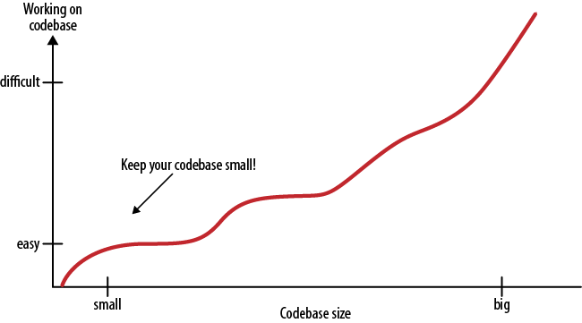

# Самый важный навык, который может освоить программист

*Перевод статьи [Huseyin Polat Yuruk](https://twitter.com/hpolatyuruk): [The most important skill a programmer can learn
](http://huseyinpolatyuruk.com/2019/05/03/the-most-important-skill-a-programmer-can-learn/).*

**Нет, нет, нет, нет и нет. И нет.**

Photo by [Gemma Evans](https://unsplash.com/@stayandroam) on [Unsplash](https://unsplash.com/)

**Нет, нет, нет, нет и нет. И нет.**

Огромное НЕТ. Давайте проясним это.

Все, что вам нужно сделать, это соединить эти три буквы и произнести слово.

Давайте сделаем это вместе. НЕЕЕЕЕЕЕТ!

Хорошее начало.

Но подождите-ка минуточку. Зачем и когда говорить НЕТ?

Что ж, это важный момент. Многие программисты (даже синьоры) путаются.

Самая большая часть вашей работы как программиста — написание кода. В вашей жизни разработчика придется часто иметь дело с разными видами требования написать тот или иной код. Каждое требование заставит вас принимать сложные решения. Это НОРМАЛЬНО. В этом нет ничего плохого. Это все, что ожидают от программиста: написание кода. Итак, вопрос: нужно ли писать весь код, который от вас требуют?

Этот вопрос подводит нас к самому важному навыку, который может усвоить программист:

> Знание того, когда не следует писать код, возможно, является наиболее важным навыком, который может освоить программист. — —  Читаемый код, или Программирование как искусство

Сначала я совсем не мог с этом согласиться. Я задавался вопросом: это с чего бы?

Программирование — это искусство решения проблем. Естественно, программисты решают проблемы. Как программисты, когда перед нами возникает новая проблема, готовая к решению, или по любой другой причине нужно написать какой-нибудь код, мы начинаем волноваться. 

И это нормально, потому что мы программисты. Мы любим писать код.

Однако, если писать код слишком взволнованным, можно не заметить чего-то важного. Волнение заставляет нас игнорировать некоторые важные факты, которые могут вызвать серьезные проблемы в будущем.

Итак, какие важные факты мы склонны игнорировать?

Каждая написанная строчка кода:

- код, который должен быть прочитан и понят другими программистами;
- код, который должен быть протестирован и отлажен;
- код, который добавит дефекты в вашу программу;
- код, который, вероятно, приведет в багам в будущем.

Как писал Рич Скрента, [код — наш враг](http://www.skrenta.com/2007/05/code_is_our_enemy.html):

> Код — это плохо. Он гниёт. Он требует периодического обслуживания. В нем есть баги, которые нужно найти. Новые функции означают, что старый код нужно править.

> Чем больше у вас кода, тем больше возможностей совершить ошибку. Больше времени уходит на проверки или на компиляцию. Новый сотруднику требуется все больше времени, чтобы понять вашу систему. Рефакторинг становится сложнее.

> Кроме того, больше кода часто означает меньшую гибкость и функциональность. Это кажется нелогичным, но во многих случаях простое, элегантное решение оказывается более быстрым и общим, чем сложный код, созданный менее опытным программистом.

> Код производится инженерами. Чтобы писать больше кода, нужно больше инженеров. На коммуникации требуется время, которое растет квадратично от числа программистов. И весь код, который разработчики добавляют в систему еще больше увеличивает эту цену.

Это правда, не так ли? Программисты, которые вдохновляют вас своей продуктивностью и стилем программирования, — это те, кто знает, когда говорить «нет», когда не писать код. Простое в обслуживании программное обеспечение, которое живет долго и помогает пользователям, не содержит лишних строк кода.

> Лучший код — это вовсе не код, а самый эффективный программист — это тот, кто знает, когда не писать код.

## Как узнать, когда не нужно кодировать?

Это нормально, если при работе над проектом вы взволнованы и думаете обо всех интересных функциях, которые хотелось бы реализовать. Но программисты склонны переоценивать, сколько функций нужно их проектам. Многие функции остаются незавершенными, не используются, или просто усложняют приложение. Вы должны хорошо представлять, что важно для вашего проекта, чтобы избежать этой ошибки.

> Понимание цели программы и определение его ядра — это первый шаг к пониманию того, когда не следует писать код.

Позвольте привести пример. Допустим, у вас есть приложение для управления электронной почтой. Отправка и получение электронных писем — две важные функции вашего приложения. Вы не станете ожидать, что это приложение также будет управлять вашим списком дел, не так ли?

Поэтому вы должны сказать НЕТ любым запросам на новые функции, которые не имеют отношения к ядру приложения. Тогда вы будете точно уверен, что знаете, когда не следует писать код.

> Никогда не расширяйте цель вашего приложения.

Как только вы поймете, что является ядром вашего проекта, вы осознаете, как оценивать возможные запросы на написание нового кода. Вы будете точно знать свои требования для написания кода. Какая функция должна быть реализована? Какой код стоит написать? Вы будете подвергать сомнению все, потому что будете точно знать — ненужный код может убить ваш проект.

> Знание того, когда не нужно писать код, делает вашу кодовую базу маленькой.

Читаемый код, или Программирование как искусство

При старте проекта в нем всего два или три файла с исходным кодом. Все выглядит так просто. Сборка и запуск кода занимает всего несколько секунд. Вы знаете, где найти то, что вам нужно.

Затем, по мере роста проекта, все больше и больше файлов исходного кода заполняют вашу директорию с проектом. Каждый файл кода содержит сотни строк кода. Чтобы организовать их все, вам понадобятся несколько директорий. Помнить, какие функции вызывают какие все сложнее, а отслеживание ошибок требует немного больше усилий.  Управлять вашим проектом становится трудно, и вам нужно больше программистов, чтобы справиться с этим. Затраты на коммуникации возрастают по мере увеличения числа программистов. Вы все замедляетесь и замедляетесь.

В итоге проект становится огромным. Добавление новых функций невероятно болезненно. Даже внесение небольших изменений занимает несколько часов. Исправление багов приводит к новым багам. Вы начинаете опаздывать к срокам.

Теперь жизнь — это борьба. Почему?

Потому что вы не знали, когда не следует писать код, вы отвечали ДА каждой новой функции. Вы были слепы. Создание чего-то нового заставило вас игнорировать существенные факты.

Похоже на фильм ужасов, верно?

Это то, что произойдет, если вы продолжаете говорить ДА всему. Запомните, когда не нужно писать код. Удалите весь ненужный код из вашего проекта. Это облегчит вашу жизнь и продлит срок службы приложения.

> Один из моих самых продуктивных дней был, когда я выбросил 1000 строк кода. — Кен Томпсон

Я знаю, что понять, когда не нужно писать код, очень сложно. Даже для опытных программистов. Возможно, написанное в этой статье, трудно понять начинающим программистам, и это нормально и ожидаемо.

Я знаю, вы только начали свой путь программирования и хотите писать код. Вы так взволнованы этим. Это хорошо. Никогда не теряйте это волнение, но и не игнорируйте важные факты. Мы узнали их, делая свои собственные ошибки. Вы тоже будете совершать ошибки и учиться на них. Но, по крайней мере, вы можете быть более осознанными, если извлечете уроки из нашего опыта.

> Продолжайте писать код, но знайте, когда остановиться.

- - - -

*Слушайте наш подкаст в [iTunes](https://itunes.apple.com/ru/podcast/девшахта/id1226773343) и [SoundCloud](https://soundcloud.com/devschacht), читайте нас на [Medium](https://medium.com/devschacht), контрибьютьте на [GitHub](https://github.com/devSchacht), общайтесь в [группе Telegram](https://t.me/devSchacht), следите в [Twitter](https://twitter.com/DevSchacht) и [канале Telegram](https://t.me/devSchachtChannel), рекомендуйте в [VK](https://vk.com/devschacht) и [Facebook](https://www.facebook.com/devSchacht).*

*Если вам понравилась статья, внизу можно поддержать автора хлопками 👏🏻 Спасибо за прочтение!*
